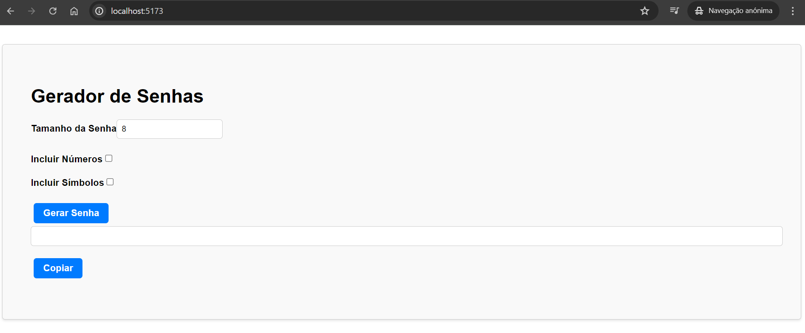

# Gerador de Senhas com useState

Este projeto é um gerador de senhas simples, criado com React, com o objetivo de estudar e praticar o hook `useState`. Ele permite que os usuários gerem senhas aleatórias com base em suas preferências, como o tamanho da senha e a inclusão de caracteres especiais e números.

## Objetivo do Projeto

O objetivo deste projeto é proporcionar um ambiente prático para explorar e entender o uso do `useState` no React. Este projeto é ideal para iniciantes que desejam aprender como gerenciar estado em componentes funcionais.

## Funcionalidades

- **Gerar Senhas Aleatórias**: O usuário pode gerar senhas aleatórias com base nas preferências selecionadas.
- **Preferências do Usuário**: O usuário pode definir o tamanho da senha e optar por incluir números e caracteres especiais.
- **Copiar Senha**: A senha gerada pode ser copiada para a área de transferência com um clique.

## Captura de Tela

